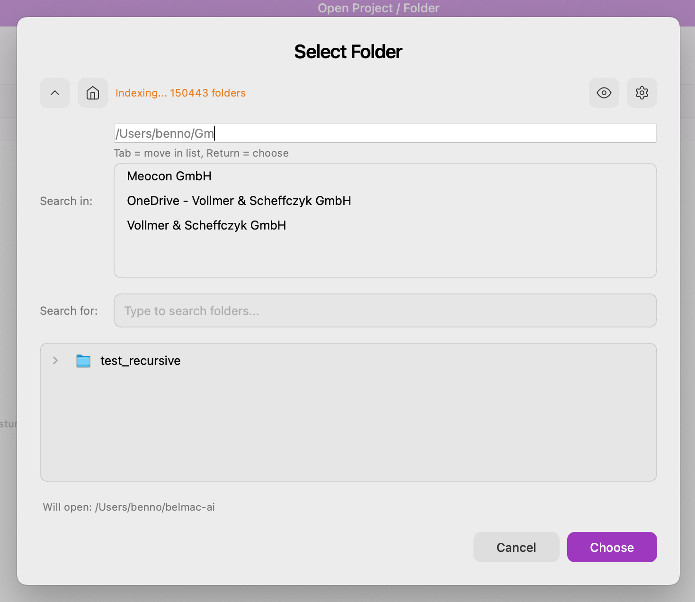

# macos-search

A standalone macOS app for fast folder/file search across `$HOME`.
Type, see results, click to open or reveal in Finder.



## Highlights

- **In-memory cache** of every folder under `$HOME`, kept live via
  FSEvents. First scan ~tens of seconds; subsequent search ≤ 50 ms.
- **Multi-term AND search** with purple highlighting on matched
  fragments. Counts subfolder matches as a small pill badge.
- **Finder-style sidebar** of favorites — Home, Documents, Downloads,
  Desktop, Macintosh HD seeded on first run; user can add the current
  search-in path with `+ Add current` or right-click any favorite to
  make it the default / delete it.
- **Two open actions per result**: *Open with App* (default app) and
  *Open in Finder* (reveal in parent view). Available as buttons or via
  ⏎ / ⌘⏎.
- **Mouseless first**: ⌘F / ⌘L / ⌘H / ⌘↑ / Esc are all wired; the
  persistent shortcut hint line at the bottom of the window keeps the
  full map visible.
- **macOS-only.** Built on Qt 6 with C++17 and CMake.

## Status

Working app. **155 tests across 8 classes**, all passing. Originally
lifted from [maude-cp-v3](../maude-cp-v3); now a standalone fork —
see [`docs/050_porting_rules.md`](docs/050_porting_rules.md) for the
lift history.

The cache + search core, the favorites sidebar, the keyboard map,
the threading-correct `ExcludeSettings`, and the priority-driven scan
strategy all live here.

## Quick start

Requires Homebrew Qt 6 (`brew install qt`) and CMake ≥ 3.21.

```sh
./br                  # debug build + run
./br --no-debug       # release build + run
./br --test           # run the test suite (101 tests, ~5 s)
./br --detach         # launch in background; useful for screenshots
./br -c               # clean rebuild
./br --help           # all flags
```

The build script writes into `build-benno/` by default, or `build/`
when invoked with `--who=claude` (used by automation).

## Repository layout

```
src/
  PathCacheManager.*       in-memory folder cache, BFS scan, FSEvents
  FolderSearchWorker.*     debounced multi-term search worker
  SearchField.*            QLineEdit wrapper with 150 ms debounce
  ExcludeSettings.*        thread-safe pattern store (QReadWriteLock)
  ExcludeSettingsDialog.*  pattern-editing dialog
  PathSelector/            5-state path-completion widget family
  FolderBrowserDialog.*    the main UI — sidebar, picker, results
  SwiftUIStyle.*           palette + stylesheet helpers
  IconRegistry.*           SVG icon lookup + tinting
  ThemeManager.*           dark/light detection
  MaudeConfig.*            ~/.macos-search config dir
  main.cpp                 entry point

tests/                     QTest classes + aggregate runner
assets/icons/              SVGs registered via icons.qrc
docs/                      see docs/000_index.md
scripts/                   br.sh, screenshot.sh, ui-drive.sh
```

## Tests

`./br --test` runs `macos-search_tests`, a single QTest binary on the
`offscreen` Qt platform. Coverage in `docs/060_test_strategy.md`:

- 31 tests for `ExcludeSettings` (exclusion semantics, persistence, threading).
- 13 tests for `PathCacheManager` (scan lifecycle, search invariants).
- 16 tests for `SearchField` (debounce, signals).
- 8 tests for `PathSelectorState` (5-state machine).
- 9 tests for `FolderBrowserDialog` (favorites, default, both Open buttons).
- 24 tests for `UserInteractionTest` — **user-perspective tests** that
  simulate keystrokes and clicks against a live dialog and assert outcomes.

To re-run a single class: `./build/macos-search_tests --filter UserInteractionTest`.
To watch tests visually: `QT_QPA_PLATFORM= ./build/macos-search_tests`.

## Screenshots-as-tests

For interactive UI verification:

```sh
./br --detach                            # launch the app in the background
./scripts/screenshot.sh empty            # capture the window → screenshots/
./scripts/ui-drive.sh type "trafo"       # type a query
./scripts/screenshot.sh trafo-results
./scripts/ui-drive.sh quit               # exits only macos-search, nothing else
```

The screenshot script uses `screencapture -R` with bounds from
AppleScript — works on a fresh machine with no extra permissions.
Keystroke synthesis (`ui-drive.sh type`) needs macOS *Accessibility*
permission for whichever app hosts the calling shell — see
`docs/100_dev_workflow.md` for the exact diagnostic.

## Docs

Start at [`docs/000_index.md`](docs/000_index.md).

**Read these first** if you're touching the relevant code:

- [`docs/120_qt_threading.md`](docs/120_qt_threading.md) — Qt threading rule and the data race we fixed in `ExcludeSettings`. Touch the cache or worker code? Read this first.
- [`docs/140_keyboard_shortcuts.md`](docs/140_keyboard_shortcuts.md) — full keyboard map.
- [`docs/130_favorites.md`](docs/130_favorites.md) — sidebar design + persistence.
- [`docs/050_porting_rules.md`](docs/050_porting_rules.md) — lift history; what came from upstream, what we changed locally.
- [`docs/qt-reference/050_folder_search.md`](docs/qt-reference/050_folder_search.md) — the cache + search architecture, imported verbatim from upstream.

## License

`TBD` — same as upstream `maude-cp-v3` once the distribution path is
decided. See `docs/070_build_and_ship.md`.
